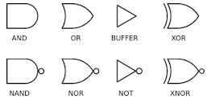

## Lecture 4

### Announcements
- Tuesday lectures in SF1101
- Practicals start on 23/9 or 26/9

### Logic Gates

### Truth Gates

| $x_1$ | $x_2$ | AND |
| --- | --- | ------- |
| 0 | 0 | 0 |
| 0 | 1 | 0 |
| 1 | 0 | 0 |
| 1 | 1 | 1 |

| $x_1$ | $x_2$ | OR |
| --- | --- | ------- |
| 0 | 0 | 0 |
| 0 | 1 | 1 |
| 1 | 0 | 1 |
| 1 | 1 | 1 |

#### Design Example:
Switches x and y and a light L. L is off if both x and y are on or off.

Truth table:

| $x_1$ | $x_2$ | NOR |
| --- | --- | ------- |
| 0 | 0 | 0 |
| 0 | 1 | 1 |
| 1 | 0 | 1 |
| 1 | 1 | 0 |

#### Additional Gates:

| $x_1$ | $x_2$ | NAND |
| --- | --- | ------- |
| 0 | 0 | 1 |
| 0 | 1 | 1 |
| 1 | 0 | 1 |
| 1 | 1 | 0 |

NAND (not and) gates are used because they are cheaper to produce than combining NOT and AND (4 vs 6 transistors). They are **functionally complete**, ie they can implement all logic functions.

| $x_1$ | $x_2$ | NOR |
| --- | --- | ------- |
| 0 | 0 | 1 |
| 0 | 1 | 0 |
| 1 | 0 | 0 |
| 1 | 1 | 1 |

NOR (not or) gates are also **functionally complete**. Similarly, NOR is cheaper to build than OR (4 vs 6 transistors).

### Sum of Products
- Literal: any variable or its complement
- Product Term: synonym for AND
- Sum Term: synonym for OR
- Sum of Products: as the name suggests
- Minterm: a product term that evaluates to 1 for exactly 1 row of truth table
- Canonical SOP: SOP expression for a function that comprises its minterms

Example:

| $x_1$ | $x_2$ | $x_3$ | Minterm |
| --- | --- | --- | ------- |
| 0 | 0 | 0 | $\overline{x_1}\overline{x_2}\overline{x_3}$ |
| 0 | 0 | 1 | $\overline{x_1}\overline{x_2}x_3$ |
| 0 | 1 | 0 | $\overline{x_1}x_2\overline{x_3}$ |
| 0 | 1 | 1 | $\overline{x_1}x_2x_3$ |
| 1 | 0 | 0 | $x_1\overline{x_2}\overline{x_3}$ |
| 1 | 0 | 1 | $x_1\overline{x_2}x_3$ |
| 1 | 1 | 0 | $x_1x_2\overline{x_3}$ |
| 1 | 1 | 1 | $x_1x_2x_3$ |

The short forms above are $m_0, m_1, m_2, \dots, m_7$, and a function can be represented as
$$f = m_0 + m_1 + m_2 + m_3 + m_6 + m_7$$
