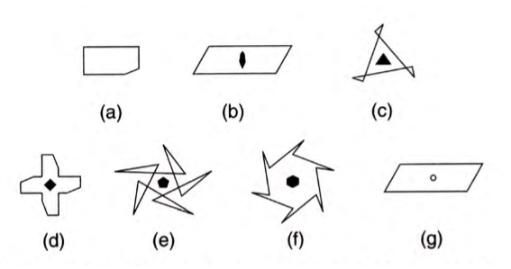
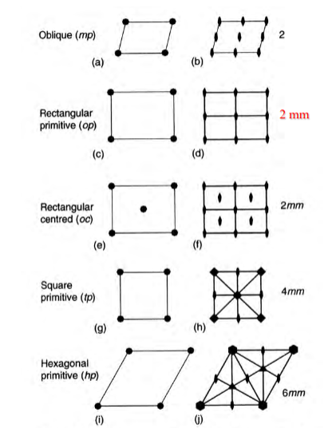

## Lecture 3

### Rotational Symmetry
The number of times the image repeats in a $2\pi$ rotation about a point. By definition every image repeats at least once.

### Reflectional Symmetry
The image overlaps itself when "folded" along the mirror plane

### Notation

### Rotational Axis

Mathematics tells us that the only possible rotational symmetries are 1,2,3,4,6 fold.

### Symmetry of Plane Lattices
  

- Can be used to describe motif
- Alternative way of describing lattice

#### International Symmetry Notation
Point Group Symbols:  
- Primary: rotation axis
- Secondary: mirror lines (a axis)
- Tertiary: mirror lines (b axis)

### Crystallographic Plane Point Symmetry Groups
1. List all symmetry elements present
2. Order symmetry elements following rules
3. Compare to list of allowed symmetry groups

Includes 1, 2, 3, 4, 6, m, 2mm, 3m, 4mm, 6mm

### Symbol Nomenclature
| Lattice | Rotational | Secondary | Tertiary |
| --- | --- | --- | --- |
| Primitive/Centred | Rotational Symmetry | Mirror plane (symmetry from rotation included) | Mirror plane '' |

### Glide Symmetry
A lattice has **glide symmetry** alongs its **glide axis** if the plane, reflected along the glide axis with one half translated $\frac{T}{2}$ along the axis, repeats itself. $T$ denotes the lattice repeat vector, the shortest distance parallel to the glide axis when the lattice repeats.

### 17 Plane Groups
Includes p1, p2, pm, pg, cm, p2mm, p2mg, p2gg, c2mm, p4, p4mm, p4gm, p3, p3m1, p31m, p6, p6mm  
*(Note: g stands for glide symmetry)*
