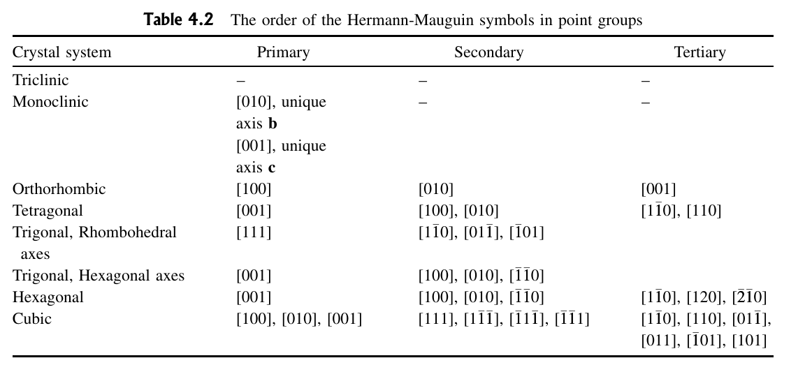

## Lecture 4

### General Equivalent Positions
- A **general position** is an arbitrary $(x,y)$ occupied by a motif
- Given $(x,y)$, tells us which other positions are equivalent
	- e.g. for p2, $(x,y)$ and $(\overline{x}, \overline{y})$ are equivalent
- Number of equivalent positions for a given point is called its **multiplicity**
- Special position: position where multiplicity is not at maximum
	- e.g. multiplicity of a general element in p4 is 4, but that of $(0,0)$ is 1

### Wyckoff Symbols
- Starts from $a$
- Increases with multiplicity

### Terminology
- Chirality: property of a chemical whose mirror reflection **cannot** be produced by any combination of rotation and translation
- Enantiomer: object that demonstrates chirality. Comes in pairs

### Centre of Symmetry
- Denoted by $\overline{1}$
- Does not exist in 2D as it simplifies to a mirror transformation
	- However it is unique in 3D

### Rotoinversion
- Compound Inversion: a rotation then an inversion about the centre of symmetry
- also known as improper rotation
- $n$-fold rotoinversion: a $2\pi/n$ rotation about the axis, then an inversion about the centre of symmetry
- Denoted as $\overline{n}$

### Rotoreflection
- Compound Inversion: a rotation then an inversion about the centre of symmetry
- also known as improper rotation
- $n$-fold rotoreflection: a $2\pi/n$ rotation about an axis **normal** to the mirror plane, then a reflection about the plane
- Denoted as $\tilde{n}$

### 3-D Point Group Symbol Nomenclature

### 3-D Point Groups
- Primary, Secondary, Tertiary axes in order
- Example: mP has a symbol of $\frac{2}{m}$, as along its primary axis, there is a 2-fold rotational symmetry and a mirror plane perpendicular to it

### Crystallographic Point Groups
- 7 lattice symmetries
- Allowed point group operations: $1,2,3,4,6,\overline{1},\overline{3},\overline{4},\overline{6},m$
- 33 in total
