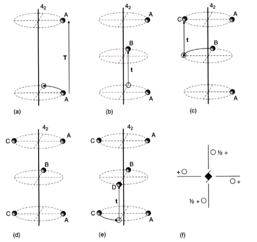
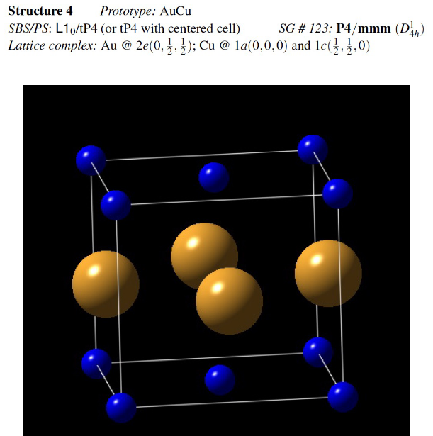

## Lecture 5

### Screw Motion

- Compound Operation: rotation then translation
- Notation $n_p$, where the atom is rotated by $\frac{2\pi}{n}$ anticlockwise and shifted upwards by $\frac{p}{n}T$, where $T$ is the lattice repeat
- Note that if $n$ and $p$ have common factors, the final angle of the same particle at $z=0$ and $z=T$ are different, so each "layer" has more than 1 atom, as lattices have to repeat

### Space Group Lattice Symbols
- A: A-face centred
- B: B-face centred
- C: C-face centred

### Space Group Symbols
- a: glide vector along a
- b: glide vector along b
- c: glide vector along c
- n: diagonal glide plane
- d: diamond glide plane

### Space Group P4
- p4 plane group stretched vertically

| Multiplicity | Wyckoff letter | Site symmetry | Coordinates of equivalent positions |
| --- | --- | --- | ------- |
| 4 | d | 1 | $(x,y,z), (\overline{x},\overline{y},z), (\overline{y},x,z), (y,\overline{x},z)$ |
| 2 | c | 2 | $(0,\frac{1}{2},z),(\frac{1}{2},0,z)$ |
| 1 | b | 4 | $(\frac{1}{2},\frac{1}{2},z)$ |
| 1 | a | 4 | $(0,0,z)$ |

### Space Group P41

| Multiplicity | Wyckoff letter | Site symmetry | Coordinates of equivalent positions |
| --- | --- | --- | ------- |
| 4 | a | 1 | $(x,y,z), (\overline{x},\overline{y},z), (\overline{y},x,z), (y,\overline{x},z)$ |

### Complete Specification of Any 2-D or 3-D Crystal Structure
- Lattice Parameters
	- p, c, etc
- Space Group Symbol
	- 2, 4, 6, etc
- List of atom types and coordinates (Wyckoff letter)

### AuCu

- tP4
- P$\frac{4}{m}\frac{2}{m}\frac{2}{m}$
- Wyckoff letters
	- e at $\left(0,\frac{1}{2},\frac{1}{2}\right)$
	- a at $(0,0,0)$
	- c at $\left(\frac{1}{2},\frac{1}{2},0\right)$
